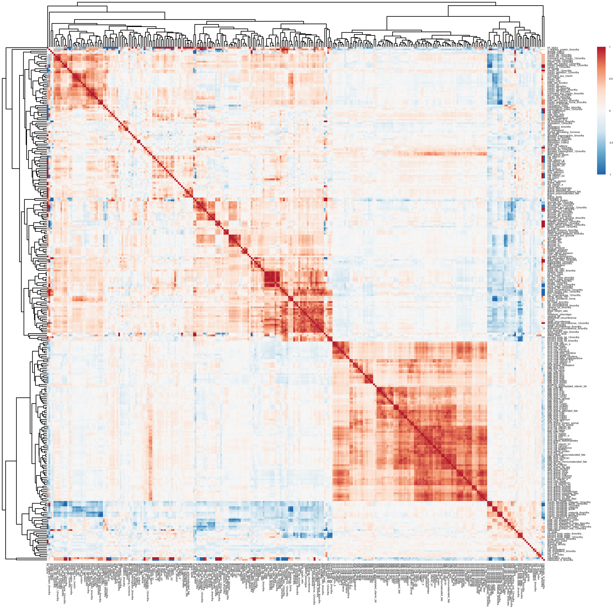

# Clinical data

```{r}
library(mbtools)
library(ggplot2)

theme_set(theme_bw())
status_map <- c("healthy", "IFG", "IGT", "IFG+ITG", "T2D", "T2D treated")

ps <- readRDS("../data/taxonomy_clean.rds")
meta <- as.data.table(as(sample_data(ps), "data.frame"))
meta <- meta[, !grepl("months", names(meta)), with=FALSE]
meta[, diabetes_status := factor(status_map[diabetes_status], levels=status_map)]
```

### Population design

```{r, fig.width=5, fig.height=2}
counts <- meta[order(diabetes_status), .N, by=diabetes_status]
ggplot(counts, aes(x=diabetes_status, y=N, fill=diabetes_status)) + geom_bar(stat="identity") + guides(fill=F) +
  labs(x="", y="n")
ggsave("population.svg", width=5, height=2)
```


### Correlations between clinical variables

Block on upper left is insulin and glucose, small block in the center is obesity, large block in lower left is diet.

```{r}
library(pheatmap)
corrs <- cor(meta[, sapply(meta, is.numeric), with=F], method="spearman", use="pairwise.complete.obs")

colors <- colorRampPalette(rev(RColorBrewer::brewer.pal(n = 7, name = "RdBu")))(128)
pheatmap(corrs, col=colors, border_color=NA, filename="cors.png", fontsize=3,
         width=8, height=8)

```

```{r}
rich_corrs <- sort(corrs["richness", ])
data <- meta[, sapply(meta, is.numeric), with=F]

pearson_stats <- function(x) {
  test <- cor.test(data$richness, x, method="spearman", exact=F, continuity=T)
  return(c(test$estimate, pval=test$p.value))
}

pearson <- as.data.frame(t(apply(data, 2, pearson_stats)))
pearson$fdr <- p.adjust(pearson$pval, method="fdr")
pearson[order(pearson$pval), ]
```


### Relationship between diabetes and obesity

Number of phenotype variables used:

```{r}
ncol(meta) - 1  # have to subtract the ID column
```


Distribution of groups:

```{r}
table(meta$diabetes_status)
```

Previous metformin treatment/consumption:

```{r}
table(meta$metformin, meta$diabetes_status)
```


BMI raises slightly with group. Treated patients seem to have lost weight again.

```{r}
pl <- ggplot(meta, aes(x=diabetes_status, y=bmi, col=diabetes_status)) + geom_jitter(width=0.3) + 
  geom_smooth(method="glm", aes(group=0, x=as.numeric(diabetes_status))) +
  guides(color=FALSE) + labs(x="", y="BMI")
ggsave("status_vs_bmi.svg", width=6, height=4)
pl
```

Pretty clear association between BMI and area under the glucose curve, however there is no clear BMI (vertical line) to separate healthy from diabetic.

```{r}
pl <- ggplot(meta, aes(x=bmi, y=auc_glucose, col=diabetes_status)) + geom_point() + 
  geom_smooth(method="glm", aes(group=0)) + scale_y_log10(breaks=c(5000, 10000, 20000, 50000)) +
  labs(x="BMI", y="area under glucose curve", color="group")
ggsave("auc_vs_bmi.svg", width=6, height=4)
pl
```

Visceral fat also associates with the area under the glucose curve. The same for percent body fat, but with a lower Spearman correlation (0.5 vs 0.3).

```{r}
pl <- ggplot(meta, aes(x=visceral_fat, y=auc_glucose, col=diabetes_status)) + geom_point(alpha=0.5) + 
  labs(x="visceral fat [%]", y="area under glucose curve", color="group")
ggsave("fat_vs_auc.svg", width=6, height=4)
pl
```


Correlations:

```{r}
print(cor.test(~ as.numeric(diabetes_status) + bmi, data=meta, method="spearman"))
print(cor.test(~ auc_glucose + bmi, data=meta, method="spearman"))
print(cor.test(~ auc_glucose + visceral_fat, data=meta, method="spearman"))
```


### Glucose and insulin curves

Pretty straight forward. We have pretty good information desnity especially in the early onset.

```{r}
cols <- c(paste0("glucose_", seq(0, 121, 30)), "id", "diabetes_status")
glc <- meta[ , ..cols]
glc <- melt(glc, c("id", "diabetes_status"), variable.name="time",
            value.name="glucose")
glc[, time := as.numeric(tstrsplit(time, "_")[[2]])]

pl <- ggplot(glc, aes(x=time, y=glucose, col=diabetes_status, group=id)) +
      geom_line(alpha=0.25, lwd=1) + guides(colour = guide_legend(override.aes = list(alpha = 1))) +
      labs(color="", x="time [min]", y="blood glucose [mg/dL]")
ggsave("glucose_curves.svg", width=6, height=4)
pl
```

insulin curver better colored by beta cell function since there is no clear pattern when by group.

```{r}
cols <- c(paste0("insulin_", seq(0, 121, 30)), "id", "beta_cell_function")
ins <- meta[ , ..cols]
ins <- melt(ins, c("id", "beta_cell_function"), variable.name="time",
            value.name="insulin")
ins[, time := as.numeric(tstrsplit(time, "_")[[2]])]

pl <- ggplot(ins, aes(x=time, y=insulin, col=beta_cell_function, group=id)) +
      geom_line(alpha=0.25, lwd=1) +
      labs(color="beta cell activity", x="time [min]", y="insulin [mg/dL]") + viridis::scale_color_viridis()
ggsave("insuline_curves.svg", width=6, height=4)
pl

```

## Microbiome data

Number of unique sequence variants:

```{r}
nrow(tax_table(ps))
```

per sample:

```{r}
present <- apply(otu_table(ps), 1, function(x) sum(x > 0))
print(c(mean(present), sd(present)))
```

Genera:

```{r}
uniqueN(tax_table(ps)[, "Genus"])
```


Ordination plot shows pretty mixed signal. The same for DCA or t-SNE.

```{r}
sdata <- as.data.frame(meta)
rownames(sdata) <- sample_names(ps)
sample_data(ps) <- sdata
ord <- ordinate(ps, method="PCoA")
plot_ordination(ps, ord, color="diabetes_status", shape = "metformin") + labs(color="group")
ggsave("ordination.svg", width=6, height=4)
```

Family distribution:

```{r, fig.width=12, fig.height=4}
pl <- plot_taxa(ps)
ggsave("phylum_bars.png", width=12, height=4, dpi=200)
pl
```

PERMANOVA:

```{r}
perm <- readRDS("../data/permanova.rds")

# Explained variance
r2s <- perm$aov.tab
```

Explained variance in Bray-Curtis with a p value cutoff of 0.05 for the coefficients:

```{r}
sum(r2s[r2s[, 6] < 0.05, 5], na.rm=T)
```

Explained variance in Bray-Curtis with a p value cutoff of 0.1 for the coefficients:

```{r}
sum(r2s[r2s[, 6] < 0.1, 5], na.rm=T)
```

