## Results summary

This is a quick write-up of putative results up to this points. Nothing should
be considered "final".

### About the data sets

There was a total of 455 samples. Of those the following 12 samples were duplicates
from different time points. Since the time information has been lost they had to
be discarded.

```
30396 30674 30726 30734 30866 30954 30985 31066 31108 31126 31149 31440
```

This left 431 samples of which 3 did not appear in the clinical meta data:

```
31507 75041 75049
```

This left 428 samples of which one (31125) was one from a different
project (status = 7) and was excluded as well. The final data set thus includes
427 samples.

Those samples contained in mean more than 100,000 reads each.

```
   Min. 1st Qu.  Median    Mean 3rd Qu.    Max.
  10752   81889  103122  106919  133697  219707
```

Read qualities were good. Some examples are shown below.

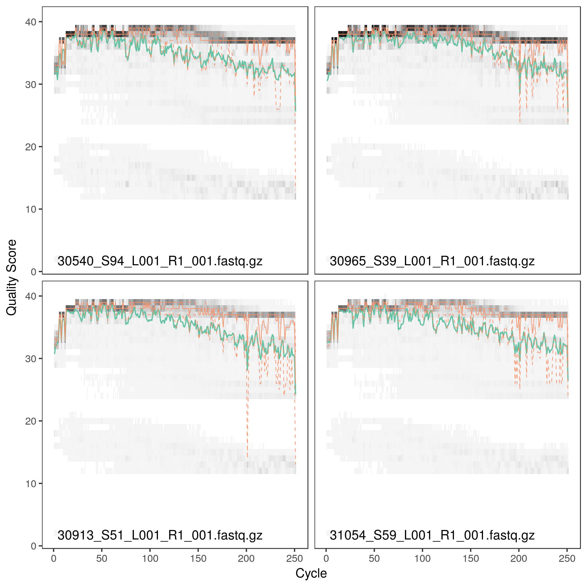
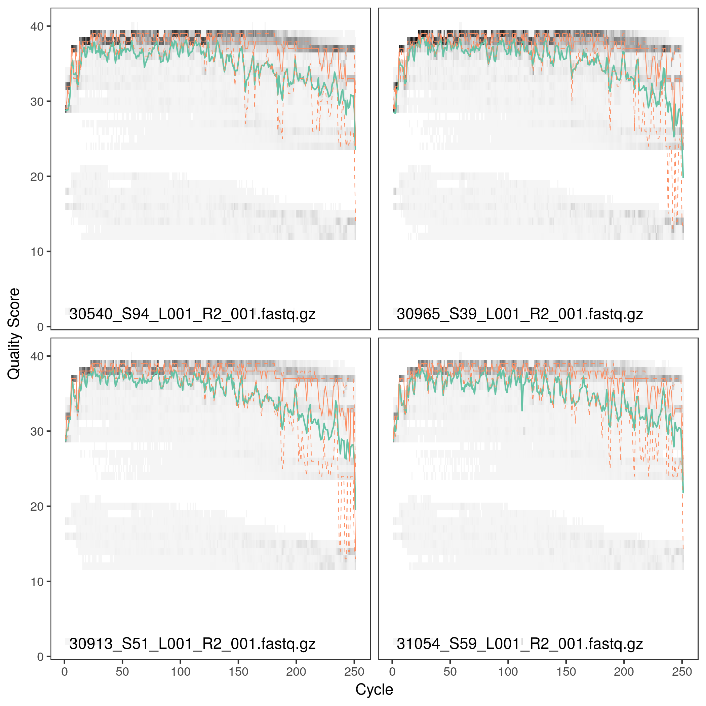

In general the clinical meta data was pretty patchy. The number of missing data
across the different variables ranged from 0 to >300 with a mean > 100, meaning
that for most clinical variables more than a quarter of measurements were missing.

```
   Min. 1st Qu.  Median    Mean 3rd Qu.    Max.
    0.0    14.5    92.0   125.8   215.5   337.0
```

Diabetes status was pretty well balanced with about half the patients being
non-diabetic and the rest distributing evenly across the other status values,
except for status 6 which only included 17 patients.

```
status
  1   2   3   4   5   6
213  51  42  57  47  17
```

Gender was skewed towards female individuals which was one the reasons to set
gender as a confounder in most association studies.

```
gender
  1   2
122 305
```

Patient's age distributed around 43 years.

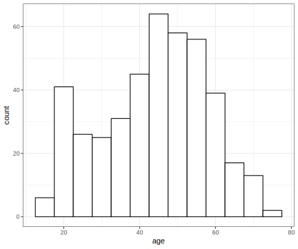

As for the remaining clinical variables Rodolfo marked a set of 130 variables
as important which are roughly grouped into diabetes, obesity, nutrition,
cardiovascular health and lifestyle. The clinical variables were mostly
uncorrelated with some clusters of correlation.

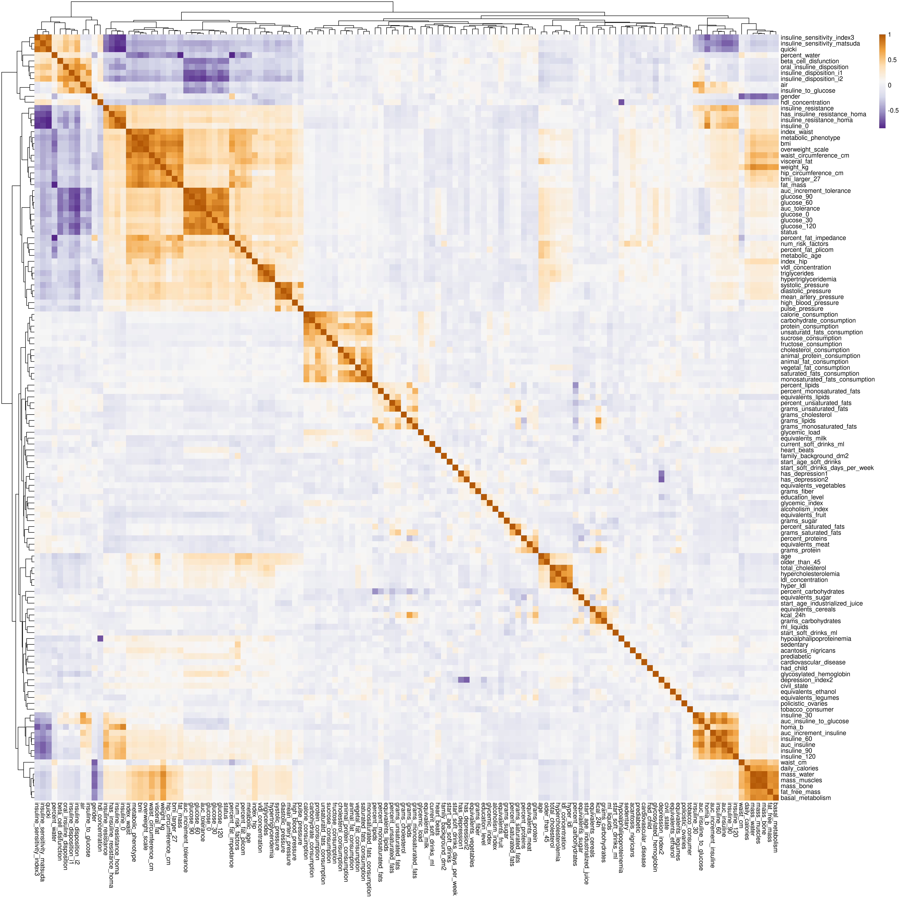

### Distribution of the microbiota

Across the samples we identified a total of 17059 sequence variants (those
should correspond to unique versions of the 16S gene). After taxonomy assignment
those fell into 378 unique genera.

Plotting alpha diversity over the status variable there is no clear association
between diversity and diabetes status as reported in other studies. The only clear
difference is visible in status 6 which could be a consequence of medication.

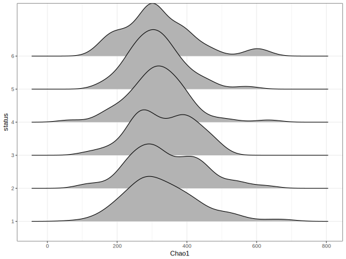

#### 12 most abundant phyla

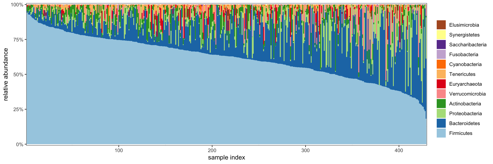

Note the trend of Firmicutes and Bacteroides being replaced by Proteobacteria
(E. coli actually).

#### 12 most abundant genera

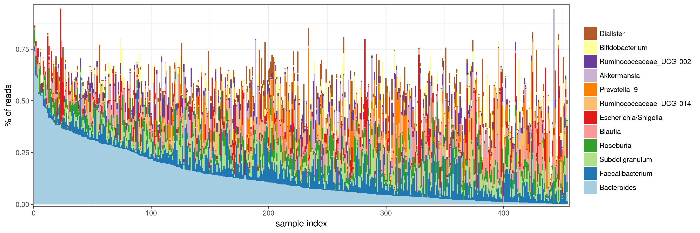

#### 12 most abundant variants

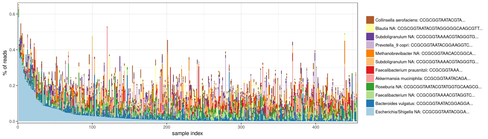

Running a PERMANOVA on genus counts using Bray's distance about 64% of the
variance between samples in the microbiota can be explained by the 130 clinical
variables. However, there is no one clinical variable that explains a large chunk
of the microbiota diversity. Most individual R^2 values are tiny.

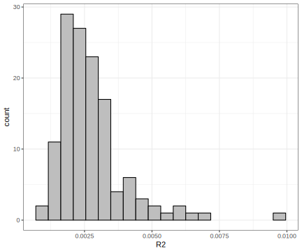

(This was run on a modified clinical data set with missing values imputed by MICE.)

### Association studies

Association studies were run between the clinical variables and genera as well
as between the clinical variables and sequence variants. For both,
genera and variants, counts were filtered by mean abundance (should be >10) and
presence (should appear at least in 10% of the samples). Counts across samples
were normalized by the estimated size factors (difference in library size) using
DESeq's "poscount" method. Library sizes seemed to be relatively homogeneous and
most results we obtain in the association studies can be reproduced with the
raw counts as well.

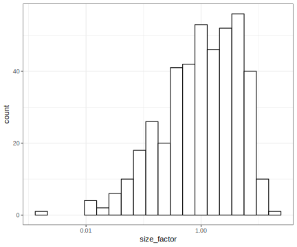

P values were adjusted to FDR cutoff using the method of Benjamini and Hochberg.

Variant and genera tests are pretty much concordant with some more additional
results in the variant test that usually correspond to small abundance variants.
In general most associations are pretty disperse and relatively low
(lfcs around 1).

The following is a list of interesting associations between genera and groups
of clinical variables.

#### Glucose-curve and diabetes

Tests:

```
      baseMean log2FoldChange      lfcSE      stat       pvalue         padj
 1: 5021.32171      0.7606119 0.13385379  6.403895 1.514623e-10 5.883388e-08
 2:   45.11496     -0.1807596 0.18876618 -3.778881 1.575344e-04 9.649589e-03
 3: 4297.96549     -0.2928320 0.08881030 -3.259062 1.117811e-03 3.870056e-02
 4: 5023.35582      0.7139870 0.12332628  5.802233 6.543736e-09 1.665104e-06
 5: 1513.27451     -0.4171984 0.11904061 -3.494579 4.748092e-04 2.112238e-02
 6: 4275.51409     -0.3329755 0.08473615 -3.883949 1.027734e-04 6.964975e-03
 7: 4961.86582      0.6158008 0.11769156  5.143739 2.693237e-07 4.930172e-05
 8: 1503.16393     -0.4568171 0.11286034 -4.006154 6.171553e-05 4.989247e-03
 9:   45.77284     -0.4515080 0.17738931 -3.931271 8.449794e-05 6.079975e-03
10: 5023.58041      0.8114828 0.12401834  6.602707 4.037169e-11 1.691999e-08
11: 1510.68354     -0.4102020 0.12044666 -3.402222 6.684029e-04 2.729964e-02
12:   46.24821     -0.5437534 0.21477278 -4.313888 1.604084e-05 1.726124e-03
13: 1096.96613      0.6801745 0.14563471  5.052520 4.360197e-07 7.715611e-05
14: 4939.55674      0.7935967 0.12805540  6.287641 3.223255e-10 1.092203e-07
15:  152.04312      0.2339827 0.21093443  4.854397 1.207536e-06 1.962369e-04
16:   28.85555      0.5833097 0.22171784  4.275403 1.907917e-05 2.012284e-03
17: 1502.85010     -0.3916930 0.12353383 -3.157912 1.589036e-03 4.894968e-02
18:   45.56213     -0.5581175 0.22437929 -4.599284 4.239449e-06 5.871084e-04
19: 1083.64676      0.6481544 0.15101107  4.824320 1.404817e-06 2.237311e-04
                   genus    variable n_test
 1: Escherichia/Shigella   glucose_0    410
 2:         Tyzzerella_4   glucose_0    410
 3:              Blautia  glucose_30    402
 4: Escherichia/Shigella  glucose_30    402
 5:           Romboutsia  glucose_30    402
 6:              Blautia  glucose_60    406
 7: Escherichia/Shigella  glucose_60    406
 8:           Romboutsia  glucose_60    406
 9:         Tyzzerella_4  glucose_60    406
10: Escherichia/Shigella  glucose_90    403
11:           Romboutsia  glucose_90    403
12:         Tyzzerella_4  glucose_90    403
13:          Veillonella  glucose_90    403
14: Escherichia/Shigella glucose_120    407
15:            Megamonas glucose_120    407
16:         Prevotella_6 glucose_120    407
17:           Romboutsia glucose_120    407
18:         Tyzzerella_4 glucose_120    407
19:          Veillonella glucose_120    407

```

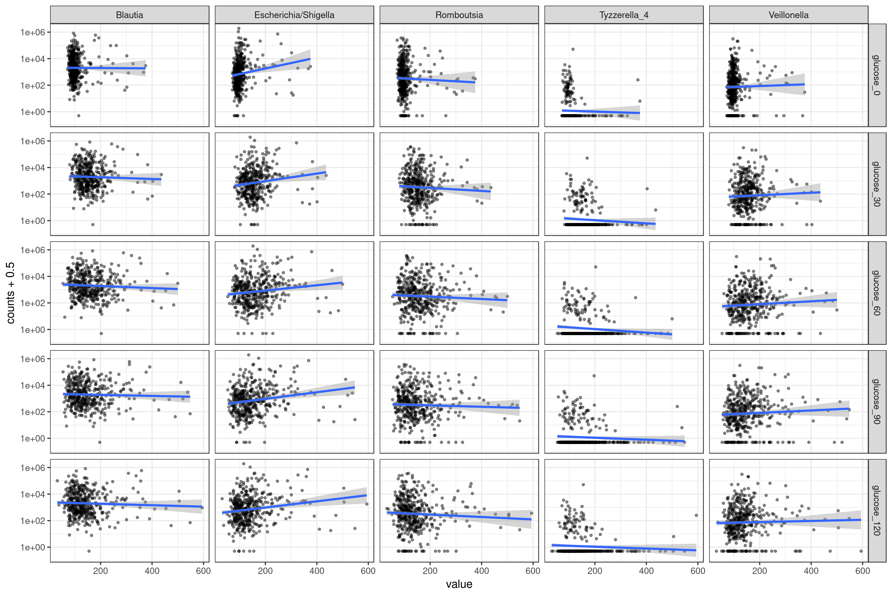

*E. coli* changes the most. In high glucose settings it almost becomes the
dominant species. Veillonella increases slightly. Some "good" genera
(Blautia, Tyzzerella) go down. Tyzzerella is interesting because *if* it is
present it is almost exclusively present in low-glucose settings.

Since diabetes is related to glucose levels we find similar things for the
diabetes status:

```
   baseMean log2FoldChange      lfcSE      stat       pvalue         padj
1: 1104.703     -0.2739661 0.06067625 -4.491539 7.071048e-06 9.081735e-04
2: 4241.667     -0.2047507 0.05143358 -3.984592 6.759619e-05 5.288999e-03
3: 1792.851      0.2413399 0.07398730  3.217368 1.293727e-03 4.337661e-02
4: 5021.322      0.4476711 0.07242051  6.120755 9.313290e-10 2.908303e-07
5: 1494.469     -0.3206123 0.06914854 -4.698439 2.621569e-06 3.976296e-04
                  genus variable n_test
1:         Anaerostipes   status    410
2:              Blautia   status    410
3:          Collinsella   status    410
4: Escherichia/Shigella   status    410
5:           Romboutsia   status    410
```

Collinsella is a consumer for a wide range of carbohydrates and produces hydrogen
and ethanol. Anaerostipes is butyrate producer that consumes lactate and acetate.

#### Cardiovascular status

Tests:

```
      baseMean log2FoldChange      lfcSE      stat       pvalue         padj
 1: 3354.68186     -0.9194848 0.33127254 -3.267505 1.084998e-03 3.814499e-02
 2:  928.14212      0.8986852 0.30298706  3.893735 9.871268e-05 6.835209e-03
 3: 1104.70255     -0.2981008 0.08819126 -3.395982 6.838298e-04 2.785338e-02
 4: 4241.66684     -0.3448819 0.07441811 -4.662387 3.125635e-06 4.566867e-04
 5:   58.80375     -0.4797307 0.14195000 -3.338863 8.412199e-04 3.189826e-02
 6: 5021.32171      0.3546439 0.10551367  3.380175 7.243971e-04 2.864635e-02
 7:  831.52958     -0.2525008 0.07560734 -3.339755 8.385247e-04 3.187194e-02
 8:  555.84521      0.5258091 0.15935400  5.549316 2.867892e-08 6.619428e-06
 9: 1530.43246      0.2961130 0.09026187  3.327714 8.756160e-04 3.281191e-02
10: 1082.81559      0.6755176 0.11894067  5.875049 4.227187e-09 1.138698e-06
11: 3704.01148     -0.4566366 0.13147776 -3.507815 4.518035e-04 2.044154e-02
12: 1104.70255     -0.2981939 0.08840363 -3.359911 7.796757e-04 3.021196e-02
13: 4241.66684     -0.2893886 0.07506455 -3.888905 1.006975e-04 6.900012e-03
14: 1530.43246      0.3971513 0.09001443  4.453882 8.433163e-06 1.033548e-03
15: 1082.81559      0.6830258 0.11913873  5.872607 4.289958e-09 1.138698e-06
16:   59.99139     -0.3402671 0.12482739 -3.162627 1.563524e-03 4.853935e-02
17: 5034.65582      0.3679918 0.10131312  3.568234 3.593961e-04 1.736632e-02
18:  594.86403      0.4422511 0.11580894  3.834368 1.258874e-04 8.216729e-03
19:  492.58752     -0.3344947 0.11250121 -3.209548 1.329438e-03 4.406205e-02
20: 4353.78914     -0.2729105 0.07827597 -3.518229 4.344374e-04 1.976814e-02
21: 5034.65582      0.3755022 0.11049232  3.380412 7.237721e-04 2.864635e-02
22: 1564.94737      0.4047298 0.09370038  4.352230 1.347597e-05 1.490405e-03
23:  965.89948      0.5817468 0.12649231  4.609541 4.035586e-06 5.687676e-04
      baseMean log2FoldChange      lfcSE      stat       pvalue         padj
                     genus             variable n_test
 1:            Akkermansia  high_blood_pressure    402
 2:            Veillonella  high_blood_pressure    402
 3:           Anaerostipes    systolic_pressure    410
 4:                Blautia    systolic_pressure    410
 5: Erysipelatoclostridium    systolic_pressure    410
 6:   Escherichia/Shigella    systolic_pressure    410
 7:       Fusicatenibacter    systolic_pressure    410
 8:            Megasphaera    systolic_pressure    410
 9:          Streptococcus    systolic_pressure    410
10:            Veillonella    systolic_pressure    410
11:            Akkermansia   diastolic_pressure    410
12:           Anaerostipes   diastolic_pressure    410
13:                Blautia   diastolic_pressure    410
14:          Streptococcus   diastolic_pressure    410
15:            Veillonella   diastolic_pressure    410
16: Erysipelatoclostridium       pulse_pressure    379
17:   Escherichia/Shigella       pulse_pressure    379
18:            Megasphaera       pulse_pressure    379
19:    Ruminiclostridium_6       pulse_pressure    379
20:                Blautia mean_artery_pressure    379
21:   Escherichia/Shigella mean_artery_pressure    379
22:          Streptococcus mean_artery_pressure    379
23:            Veillonella mean_artery_pressure    379
                     genus             variable n_test
```

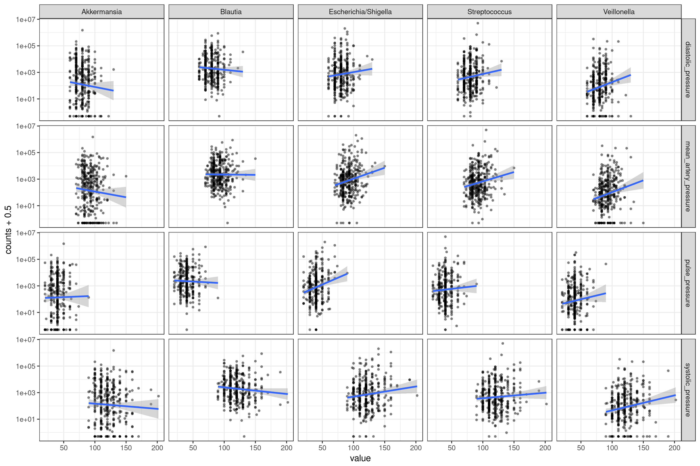

*E. coli* and Veillonella confirm their role as bad-health markers. Streptococcus
is interesting. One of the few sections where Akkermansia appears.

#### Nutrition

There was no super-clear relation between nutrition and genus abundances.
In general diet seems to affect low-abundant genera like Pseudomonas or
Porphyromonas more than high-abundant genera.

Pseudomonas is associated with:

```
 [1] "weight_kg"               "auc_tolerance"
 [3] "air"                     "homa_b"
 [5] "insuline_30"             "auc_insuline_to_glucose"
 [7] "percent_proteins"        "equivalents_cereals"
 [9] "equivalents_legumes"     "equivalents_vegetables"
[11] "grams_carbohydrates"     "grams_sugar"
[13] "grams_fiber"             "glycemic_index"
[15] "glycemic_load"           "sucrose_consumption"
[17] "fructose_consumption"    "cholesterol_consumption"
```

Porphyromonas is associated with:

```
 [1] "hypoalphalipoproteinemia"       "percent_lipids"
 [3] "percent_saturated_fats"         "percent_monosaturated_fats"
 [5] "grams_carbohydrates"            "grams_sugar"
 [7] "calorie_consumption"            "protein_consumption"
 [9] "animal_protein_consumption"     "animal_fat_consumption"
[11] "carbohydrate_consumption"       "sucrose_consumption"
[13] "fructose_consumption"           "saturated_fats_consumption"
[15] "monosaturated_fats_consumption" "unsaturatd_fats_consumption"
[17] "cholesterol_consumption"
```

#### Bad health indicators

Veillonella and E. coli are associated with a wide list of clinical variables.

Veillonella:

```
 [1] "age"                         "older_than_45"
 [3] "high_blood_pressure"         "bmi_larger_27"
 [5] "num_risk_factors"            "systolic_pressure"
 [7] "diastolic_pressure"          "mean_artery_pressure"
 [9] "waist_cm"                    "bmi"
[11] "overweight_scale"            "waist_circumference_cm"
[13] "hip_circumference_cm"        "percent_fat_plicom"
[15] "index_waist"                 "percent_fat_impedance"
[17] "fat_mass"                    "visceral_fat"
[19] "percent_water"               "metabolic_age"
[21] "glucose_90"                  "glucose_120"
[23] "auc_increment_tolerance"     "auc_tolerance"
[25] "glycosylated_hemoglobin"     "homa_b"
[27] "insuline_30"                 "insuline_60"
[29] "auc_increment_insuline"      "auc_insuline"
[31] "auc_insuline_to_glucose"     "insuline_disposition_i2"
[33] "beta_cell_disfunction"       "triglycerides"
[35] "metabolic_phenotype"         "equivalents_sugar"
[37] "glycemic_index"              "calorie_consumption"
[39] "protein_consumption"         "animal_fat_consumption"
[41] "carbohydrate_consumption"    "fructose_consumption"
[43] "unsaturatd_fats_consumption" "cholesterol_consumption"
```

E. coli:

```
 [1] "status_4_vs_1"                "status_5_vs_1"
 [3] "age"                          "sedentary"
 [5] "num_risk_factors"             "systolic_pressure"
 [7] "pulse_pressure"               "mean_artery_pressure"
 [9] "weight_kg"                    "bmi"
[11] "overweight_scale"             "waist_circumference_cm"
[13] "percent_fat_impedance"        "fat_mass"
[15] "visceral_fat"                 "percent_water"
[17] "mass_muscles"                 "mass_bone"
[19] "metabolic_age"                "glucose_0"
[21] "glucose_30"                   "glucose_60"
[23] "glucose_90"                   "glucose_120"
[25] "status"                       "auc_increment_tolerance"
[27] "auc_tolerance"                "insuline_sensitivity_matsuda"
[29] "insuline_resistance"          "insuline_resistance_homa"
[31] "has_insuline_resistance_homa" "quicki"
[33] "insuline_0"                   "insuline_sensitivity_index3"
[35] "insuline_disposition_i2"      "beta_cell_disfunction"
[37] "hypoalphalipoproteinemia"     "metabolic_phenotype"
[39] "equivalents_vegetables"       "has_depression1"
[41] "civil_state"
```

Both usually increase with declining health. Blautia and Anaerostipes are also
associated with many factors but usually decline with declining health. This can
be summarized with the variable `num_risk_factors`:

```
   baseMean log2FoldChange      lfcSE      stat       pvalue         padj
1: 1107.746     -0.3716122 0.09026319 -4.126008 3.691141e-05 3.298018e-03
2: 4251.189     -0.2446476 0.07659782 -3.205146 1.349940e-03 4.435482e-02
3: 5035.084      0.7056038 0.10823532  6.842402 7.787611e-12 3.647808e-09
4: 1085.797      0.7160694 0.12481216  5.675540 1.382518e-08 3.387381e-06
                  genus         variable n_test
1:         Anaerostipes num_risk_factors    409
2:              Blautia num_risk_factors    409
3: Escherichia/Shigella num_risk_factors    409
4:          Veillonella num_risk_factors    409
```

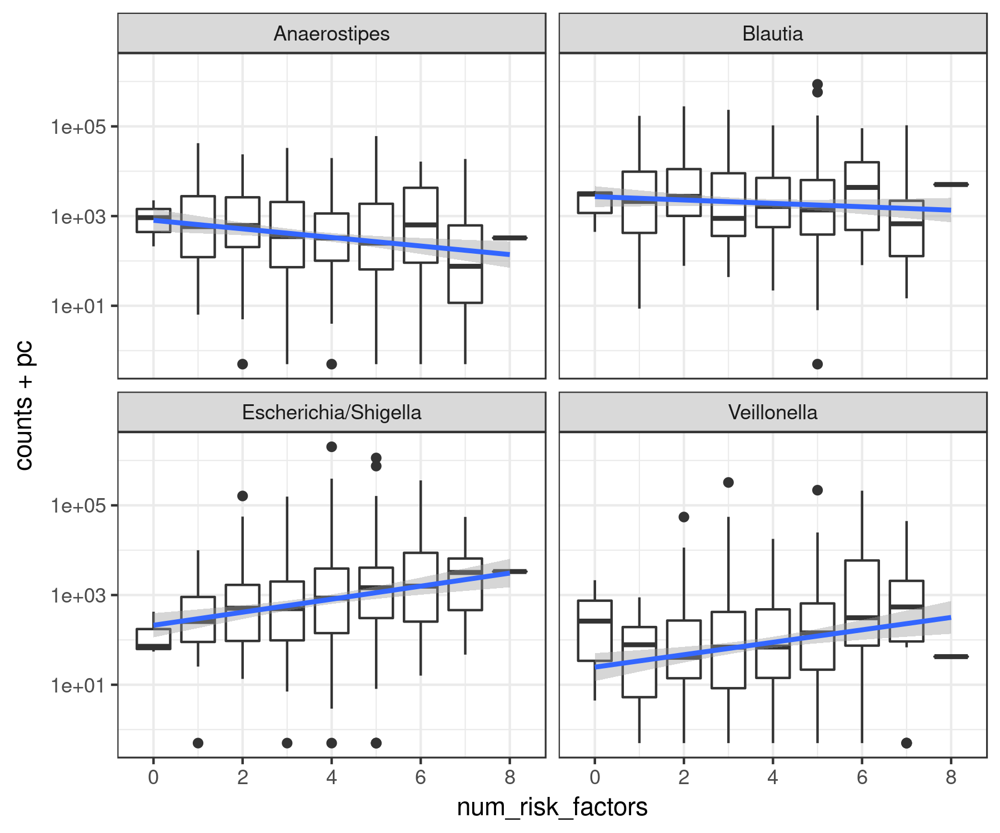
